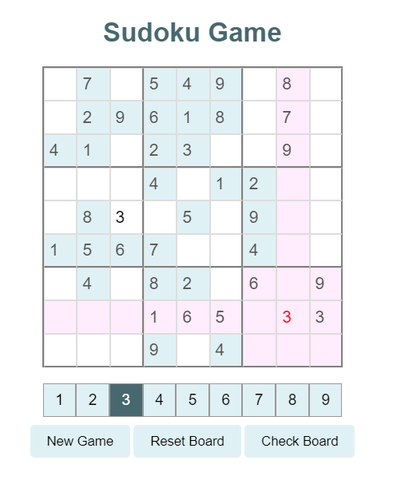

# Classic Sodoku

## Gameplay
- **New Game**: Press this button to generate a new sodoku board 
- **Reset Board**: Press this button to clear the board and restore it to its original state 
- **Check Board**: Press this button to check if your answers are correct. 
- **Number entry**: To enter numbers, you must select a number 1-9 from the bottom of the screen. The number will be marked dark gray to indicate it has been selected. Simply press an empty square to enter the number. Numbers that violate sudoku rules will appear in red text. 

## Additional Information
- All incorrect answers will appear in red text until they are correct 
- All Sodoku boards and solutions generated via Dosuku API
- When an empty box is selected, the cells in its row, column, and the 3x3 box will be highlighted to improve gameplay experience 
- Levels are chosen at random, due to the API used. If the user wishes to generate a new board, simply press new game

## Coming Soon 
- Timer: tracks how long you have been working on the puzzle 
- Leaderboard: A leaderboard containing your most recent high scores

