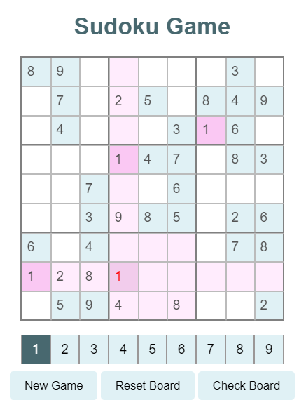

# Classic Sodoku

## Gameplay
- **New Game**: Press this button to generate a new sodoku board 
- **Reset Board**: Press this button to clear the board and restore it to its original state 
- **Check Board**: Press this button to check if your answers are correct. 
- **Number entry**: To enter numbers, you must select a number 1-9 from the bottom of the screen. The number will be marked dark gray to indicate it has been selected. Simply press an empty square to enter the number. Numbers that violate sudoku rules will appear in red text. 

## Additional Features
- All numbers that violate Sudoku rules will be displayed in red text
- To check all answers against solutions, press Check board, and all incorrect answers will appear in red text
- All Sodoku boards and solutions generated via Dosuku API
- When an empty box is selected, the cells in its row, column, and the 3x3 box will be highlighted to improve gameplay experience 
- Numbers selected from the number bar will highlight occurrences of that number on the board 
- Once a number has been placed correctly on the board, the button will be disabled 
- Levels are chosen at random, due to the API used. If the user wishes to generate a new board, simply press new game

## Coming Soon 
- Timer: tracks how long you have been working on the puzzle 
- Scoring: A point system will be put into place in future iterations
- Bug in IOS view: Due to some dependency issue the IOS view for this website makes the cells appear incorrectly
  - NOTE: This is a visual issue and should not impact gameplay for IOS users

## Developer Notes 
- API Usage (deprecated): https://sudoku-api.vercel.app/  
  -   This API was being used to generate new boards, the API was removed from online use 
-  HTML, CSS, and JS were used, should not require any additional package installations since no frameworks were used  

